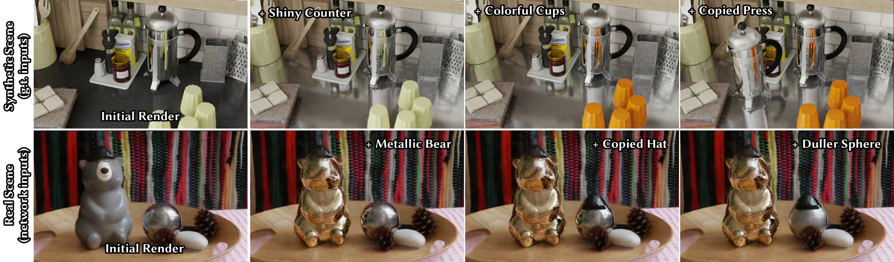

# Editable Physically-based Reflections in Raytraced Gaussian Radiance Fields 

Yohan Poirier-Ginter, Jeffrey Hu, Jean-François Lalonde, George Drettakis

[Webpage](https://repo-sam.inria.fr/nerphys/editable-gaussian-reflections/) | [Paper](https://repo-sam.inria.fr/nerphys/editable-gaussian-reflections/content/paper.pdf) | [Video](https://www.youtube.com/watch?v=Ag9xM1Zm0AY) | [Other GRAPHDECO Publications](http://www-sop.inria.fr/reves/publis/gdindex.php) | [NERPHYS project page](https://project.inria.fr/nerphys/) 
<!-- [Datasets](https://repo-sam.inria.fr/nerphys/editable-gaussian-reflections/datasets)  -->
<!-- [Pretrained Models](https://repo-sam.inria.fr/nerphys/editable-gaussian-reflections/pretrained)  -->



## Installation

We have included the official OptiX SDK header files in the third_party/optix directory as a submodule, so by default, you don't need to download the OptiX SDK from the NVIDIA official website, just add the `--recursive` flag when cloning the repository.

The default installation is as follows:

```bash
git clone git@gitlab.inria.fr:ypoirier/gaussian-splatting-raytraced.git --recursive
cd gaussian-splatting-raytraced

conda create -n editable_gauss_refl python=3.12
conda activate editable_gauss_refl

pip install torch==2.5.1 torchvision==0.20.1 torchaudio==2.5.1 --index-url https://download.pytorch.org/whl/cu121
pip install -r requirements.txt
```

To build the cuda raytracer run
```bash
bash make.sh
```
alternatively you can pip install this project.

To test if installed correctly, run
```bash
bash ./scripts/test.sh
bash ./scripts/dryrun.sh
```

### Troubleshooting
If you run into cmake or gcc version issues, try using conda to install newer versions.

```bash
conda install -c conda-forge cxx-compiler==1.6.0 -y
conda install anaconda::cmake -y
```

## Viewing and editing pretrained models
<!-- todo -->
[Pretrained models are provided here]()
<!-- todo first download-->

```bash 
MODEL_PATH=pretrained/renders/shiny_kitchen
python gaussian_viewer.py -m $MODEL_PATH
```

<!-- todo viewer during training -->

<!-- todo: describe the json -->
Selections are made with bounding box and filters detailled in `bounding_boxes.json` files. You can edit these files to add your own selections. 

## Downloading the datasets
<!-- todo -->
[Download links are provided here]()

You can download all scenes with:
```bash 
bash download_all_scenes.sh
```
<!-- todo -->

These files already contain the required network predictions and dense point clouds; detailled commands for producing these yourself are provided [further below](#detailled-commands).

## Running the scenes 
To run the synthetic scenes with ground truth inputs (`data/renders`):
```bash 
bash run_all_synthetic.sh
```

To run extra synthetic scenes used in demos and examples (chromeball and book scenes, `data/demos`):
```bash 
bash run_all_demos.sh
```

To run the synthetic scenes with network inputs (`data/renders_priors`):
```bash 
bash run_all_synthetic.sh
```
(As pointed out in the paper, we obtain rather poor results in these scenes)

To run the real scenes from the Neural Catacaustics dataset: 
```bash 
bash run_all_neural_catacaustics.sh
```
Note that in the real scenes, depth regularization was disabled since it did not improve results, and the specular loss weight was reduced significantly which seemed to work better. 

The bear scene (`neural_catacaustics/multibounce`) shown in the video was run on an older configuration which still used SfM init. Although the new configuration yields arguably better results, you can reproduce the old one with:
```
bash run_bear_scene_legacy_sfm.sh
```
As described in the paper some manual edits were applied after training (plant deleted, background reflectance removed); the json file for obtaining the same selections is provided alongside the dataset.

## Detailled commands

### Predicting network priors
Refer to the auxillary codebase
https://github.com/jefequien/GenPrior/tree/main/tools.


### Creating the initial point cloud 

```bash 
SCENE_PATH=data/renders/shiny_kitchen
python prepare_initial_ply.py --mode dense -s $SCENE_PATH
```
We recommend working with dense init; this code base does not support densification.

You may need to adjust the `--voxel_scale` flag to get good results.

The script `scripts/prepare_initial_ply.sh` contains the hyperparameters we used in all scenes.

### Training 
```bash
SCENE_PATH=data/renders/shiny_kitchen
MODEL_PATH=out/shiny_kitchen
python train.py -s $SCENE_PATH -m $MODEL_PATH
```

### Rendering test views
```bash
SCENE_PATH=data/renders/shiny_kitchen
MODEL_PATH=out/shiny_kitchen
SPP=128 # samples per pixel
python render.py -s $SCENE_PATH -m $MODEL_PATH --spp $SPP
```
We rendered at 128spp for evaluation but lower values can give adequate results.

You may need to adjust the near clipping plane with the `--znear` flag if you run other scenes.

To render a view of the reconstructed environment, use this script with the flag `--modes env_rot_1`.

### Rendering novel views
<!-- todo what aobut ffmpeg -->
```bash 
SCENE_PATH=data/renders/shiny_kitchen
MODEL_PATH=out/shiny_kitchen
SPP=128 # samples per pixel
python render_novel_views.py -s $SCENE_PATH -m $MODEL_PATH --spp $SPP
```

### Evaluation
```bash 
MODEL_PATH=out/shiny_kitchen
python metrics.py -m $MODEL_PATH
```
PSNR values should be slightly higher than reported in the paper (on average) since we fixed a minor aliasing issue with the training data. 

### Measuring framerates
```bash
MODEL_PATH=out/shiny_kitchen
python measure_fps.py -m $MODEL_PATH
```

### Editing with the interactive viewer
```bash 
MODEL_PATH=out/shiny_kitchen
python gaussian_viewer.py -m $MODEL_PATH
```

Note that to open your own real scenes with the viewer, the camera poses first need to be transformed from COLMAP to JSON, which can be done with the script `bash scripts/transforms_from_colmap.sh`. We have already done this step for the provided scenes.

## BibTeX

```
@inproceedings{
  poirierginter:hal-05306634,
  TITLE = {{Editable Physically-based Reflections in Raytraced Gaussian Radiance Fields}},
  AUTHOR = {Poirier-Ginter, Yohan and Hu, Jeffrey and Lalonde, Jean-Fran{\c c}ois and Drettakis, George},
  URL = {https://inria.hal.science/hal-05306634},
  BOOKTITLE = {{SIGGRAPH Asia 2025 - 18th ACM SIGGRAPH Conference and Exhibition on Computer Graphics and Interactive Techniques in Asia}},
  ADDRESS = {Hong Kong, Hong Kong SAR China},
  YEAR = {2025},
  MONTH = Dec,
  DOI = {10.1145/3757377.3763971},
  KEYWORDS = {path tracing ; differentiable rendering ; Reconstruction Gaussian splatting ; Reconstruction Gaussian splatting differentiable rendering path tracing ; Computing methodologies $\rightarrow$ Rendering},
  PDF = {https://inria.hal.science/hal-05306634v1/file/saconferencepapers25-163.pdf},
  HAL_ID = {hal-05306634},
  HAL_VERSION = {v1},
}
``
